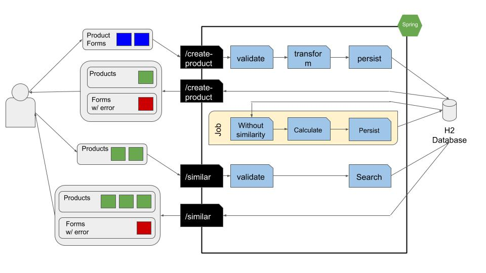

# Technical Challenge Amaro

## Product registration and similarity calculation

The objective of this test is to evaluate the knowledge in two areas of practice:
- Knowledge of JAVA and Programming Logic

The project will be evaluated by the AMARO development team, which will be based on the
following criteria:
- Organization: Folder and file structure, separation of concerns;
- Maintainability: Readability, comments, simplicity, modularity;
- Implementation: Logical implementation, use of object orientation and design patterns;
- Performance: Execution and / or response time;
- Quality: Development and execution of unit tests;
- Documentation: Installation and execution instructions; internal working descriptions;

1. Demonstration

A version of the application and complementary software are available for use in a hosted server in the Amazon 
AWS environment. From these addresses you can access the application documentation as well as perform functional tests.

Name  | Short description | URL 
--------- | ------ | ------ 
Javadocs| Code documentation | http://ec2-35-174-4-239.compute-1.amazonaws.com:8081/
Application  | Application with the challenge | http://ec2-35-174-4-239.compute-1.amazonaws.com:8080/
Swagger  | APIs documentation | http://ec2-35-174-4-239.compute-1.amazonaws.com:8080/swagger-ui.html
Database  | H2 console | http://ec2-35-174-4-239.compute-1.amazonaws.com:8080/h2-console/

Virtual machine configuration:  

Information  | value
------------ | ------
Operation system | Ubuntu Server 18.04 LTS
vCPUs | 1
Memory | 1GB
Disk | 8GB
Instance type | T2 Micro

For access the h2 console considering use of this params:  
- JDBC URL: jdbc:h2:/home/ubuntu/h2/h2  
- UserName: sa  
- Password: password

2. System information

Below we describe the main software that was used to implement the project:

Category   | Name | Version 
--------- | ------ | ------ 
Language  | Java JDK Amazon Correto | 8
Framework | Spring boot | 2.3.4.RELEASE
Database  | h2 | 1.4.200
Package manager | Maven | 3.7.0
API documentation | Swagger | 2.9.2

3. Requirements

3.1  Operational System

We consider that you are using a Linux operating system as a base in a distribution Ubuntu.

3.2  Permissions

It is necessary the user who will install the system has permission to install software or the software are 
previously registered, configured and available for use.

4. Setup Environment

4.1  Java JDK

Java JDK installation in version 8 is required.
We recommend the installation of the AWS Java JDK Correcto which is provided free of charge by AWS at the address below:

Correct AWS JDK Information:
<https://aws.amazon.com/corretto/> 

Install the Java common:
> sudo apt-get install java-common

Download of the JDK:
> wget https://corretto.aws/downloads/latest/amazon-corretto-8-x64-linux-jdk.deb

Install the deb package:
> sudo dpkg -i amazon-corretto-8-x64-linux-jdk.deb 

Check the installation version:
> java - version

4.2  GIT

To have a copy of the project repository we need to install the versioning system. As a versioning system we are using 
GIT, you can have more information about it at the address below:

<https://git-scm.com/>

Install GIT from apt:
> sudo apt-get install git

Check the installation version:
> git version

4.3  Maven

To execute the application we need to install the package manager to solve the dependencies.
The package manager used in the project is Maven and you can access the documentation in the link below:

<https://maven.apache.org/>

Install Maven from apt:
> sudo apt-get install maven

Check the installation version:
> mvn -version

5.  Installation

5.1  Checkout the project

Now we need get a copy of the project in the git remote repository.
For this action you need execute the command below:
> git clone https://github.com/mariane-muniz/amaro.git

Access the project directory
> cd amaro/

5.2  Configuring the database directory

The application uses a file type database, so we need to create a directory on the machine where the application will 
generate the files referring to the database. After creating the directory it is necessary to change the file:
> src/main/resources/application.properties

Change the property below with your directory location (Don't forget to leave the file name 'h2' after the 
address of the directory):
>  spring.datasource.url

6.  Start

To start the application you must be in the project folder (amaro folder). In the sequence you must execute the 
command below to start the application:
> mvn spring-boot:run

7.  Details

You can access more information about the APIs on Swagger through the link below:
> http://ec2-3-86-213-111.compute-1.amazonaws.com:8080/swagger-ui.html

